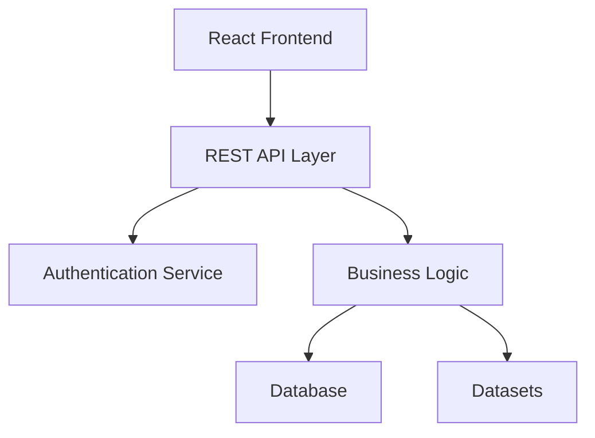
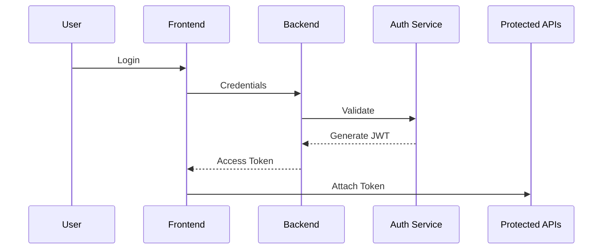

# 🚀 Go-Epic — Full Stack Coding Platform

### A scalable full-stack coding platform for practicing, managing, and organizing coding problems, datasets, solutions, and learning resources.

---

## 📖 Overview

**Go-Epic** is a full-stack coding platform built with **Golang, React, and Tailwind CSS** that helps developers manage coding problems, datasets, topics, and solutions through scalable APIs and a modern frontend interface.

The platform provides authentication, protected routes, search capabilities, analytics APIs, dataset management, and role-based access control.

### Core Objectives

* Create a scalable coding platform architecture
* Provide structured problem management
* Enable secure authentication flows
* Support dataset import/export operations
* Deliver responsive frontend experiences
* Offer analytics and monitoring capabilities

---

# ✨ Features

## Backend Features:-

✅ RESTful API Architecture<br>
✅ CRUD Operations<br>
✅ JWT Authentication & Authorization<br>
✅ Role-Based Access Control<br>
✅ Protected Routes<br>
✅ Middleware Support<br>
✅ Validation Layer<br>
✅ Pagination, Filtering & Sorting<br>
✅ Search APIs<br>
✅ Statistics APIs<br>
✅ Error Handling<br>
✅ API Metrics<br>
✅ Health Monitoring<br>
✅ Rate Limiting<br>

## Frontend Features:-

✅ Responsive Design<br>
✅ React Component Architecture<br>
✅ API Integration Layer<br>
✅ Authentication UI<br>
✅ Search Interface<br>
✅ Dashboard Pages<br>
✅ Dataset Explorer<br>
✅ Admin Management Views<br>

---

# 🏗 System Architecture



---

# 🛠 Tech Stack

| Layer            | Technology                |
| ---------------- | ------------------------- |
| Frontend         | React.js                  |
| Styling          | Tailwind CSS              |
| Backend          | Golang                    |
| API              | REST                      |
| Authentication   | JWT                       |
| State Management | React Hooks / Context     |
| HTTP Client      | Axios                     |
| Database         | MongoDB                   |
| Deployment       | Render / Railway / Vercel |

---

# 📂 Project Structure

```text
go-epic/

├── backend/
│   ├── cmd/
│   ├── config/
│   ├── controllers/
│   ├── middleware/
│   ├── models/
│   ├── routes/
│   ├── services/
│   ├── utils/
│   └── main.go
│
├── frontend/
│   ├── public/
│   ├── src/
│   │   ├── components/
│   │   ├── hooks/
│   │   ├── pages/
│   │   ├── services/
│   │   └── App.jsx
│
└── README.md
```

---

# ⚙ Installation

## Clone Repository

```bash
git clone <repo-url>

cd go-epic
```

---

## Backend Setup

```bash
cd backend

go mod tidy

go run main.go
```

Backend runs on:

```text
http://localhost:8080
```

---

## Frontend Setup

```bash
cd frontend

npm install

npm run dev
```

Frontend runs on:

```text
http://localhost:5173
```

---

# 🔐 Environment Variables

Create `.env`

```env
PORT=8080

DB_URI=your_database_uri

JWT_SECRET=secret_key

REFRESH_SECRET=refresh_key

CLIENT_URL=http://localhost:5173

RATE_LIMIT=100
```

---

# 🔑 Authentication Flow



---

# 🌐 API Base URL

```text
http://localhost:8080/api/v1
```

---

# 📚 API Documentation

## Problems API

| Method | Route      | Purpose            |
| ------ | ---------- | ------------------ |
| GET    | /problems  | Fetch all problems |
| POST   | /problems  | Create problem     |
| PATCH  | /problems/ | Update problem     |
| DELETE | /problems/ | Delete problem     |

## Authentication API

| Method | Route          |
| ------ | -------------- |
| POST   | /auth/register |
| POST   | /auth/login    |
| POST   | /auth/logout   |
| GET    | /auth/profile  |

## Search API

| Endpoint                   | Description      |
| -------------------------- | ---------------- |
| /search/problems?q=keyword | Search problems  |
| /search/topics?q=query     | Search topics    |
| /search/solutions?q=query  | Search solutions |

## Statistics API

| Route           |
| --------------- |
| /stats/problems |
| /stats/topics   |
| /stats/datasets |

---

# 📊 Dataset Import

1. Download dataset
2. Place file inside:

```text
backend/datasets/
```

3. Import:

```bash
POST /problems/import-json
```

---

# 📥 Example API Request

```json
POST /auth/login

{
  "email":"demo@gmail.com",
  "password":"password123"
}
```

Response:

```json
{
   "success": true,
   "token":"jwt_token"
}
```

---

# ❌ Error Response

```json
{
   "success": false,
   "message": "Validation Failed"
}
```

---

# 🚦 Rate Limiting

Applied on:

* Authentication APIs
* Search Endpoints
* Bulk Operations
* Admin Routes

Example:

```text
100 requests / minute
```

---

# 🧪 Testing

Backend:

```bash
go test ./...
```

Frontend:

```bash
npm run test
```

---

# 🚀 Deployment

| Service  | Platform         |
| -------- | ---------------- |
| Backend  | Railway / Render |
| Frontend | Vercel / Netlify |
| Database | MongoDB Atlas    |

Build frontend:

```bash
npm run build
```

---

# 🔮 Future Roadmap

* Contest System
* Leaderboards
* AI Recommendations
* Discussion Forums
* Multi-language Support
* Real-time Collaboration

---

# 🤝 Contributing

```bash
fork repository

create feature branch

commit changes

push branch

create pull request
```

---

# 📄 License

Licensed under the MIT License.

---

Built using ❤️ with Golang, React, and Tailwind CSS
